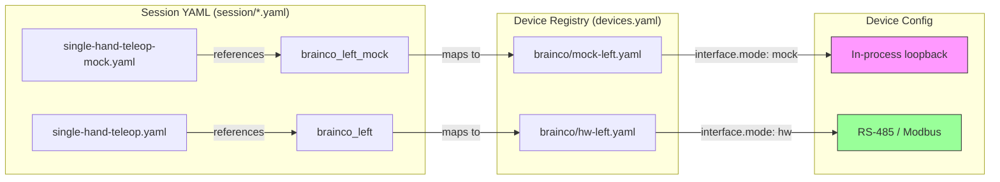

# How-To: From Mock/Viz to Real Hardware

This guide walks through the steps to go from mock (simulation / visualizer) mode to running with real hardware — the Manus Glove and BrainCo Revo2 hands.

---

## Architecture Overview

The system has two hardware abstraction layers:

| Layer              | What it controls                                                                            | Mock behavior                                                    | Real HW behavior                                    |
| ------------------ | ------------------------------------------------------------------------------------------- | ---------------------------------------------------------------- | --------------------------------------------------- |
| **Device config**  | Per-device YAML (`brainco/hw-left.yaml`, `brainco/mock-left.yaml`)                          | `interface.mode: mock` — in-process loopback, no physical device | `interface.mode: hw` — connects via RS-485/Modbus   |
| **Session config** | Which devices compose a session (`single-hand-teleop.yaml`, `single-hand-teleop-mock.yaml`) | Uses `brainco_left_mock`, `brainco_right_mock` device entries    | Uses `brainco_left`, `brainco_right` device entries |



---

## Step 1: Verify Mock/Visualizer Works

Before touching hardware, confirm the mock pipeline is functional.

```powershell
# Ensure the base environment is installed AND the Manus SDK is built
pixi install
pixi run manus-build

# Launch single-hand mock session
pixi run dexim launch --session single-hand-teleop-mock

# Or launch bimanual mock session (both hands + recorder)
pixi run dexim launch --session bimanual-teleop-mock
```

This spawns:

- **Manus node** — publishes tracker poses and skeleton states on ZMQ
- **BrainCo mock node(s)** — consume the Manus data via in-process loopback; no physical hand required
- **Recorder** (bimanual only) — records all streams

The interactive TUI shows live status for each node. Use the **Ctrl** menu (`dexim ctrl`) to send lifecycle commands (START, STOP, record, etc.).

### Visual confirmation with the 3D visualizer

In a second terminal, run the session visualizer to see the robot hands in a 3D web view:

```powershell
pixi run dexim viz --session single-hand-teleop-mock
```

Open **http://localhost:8080** in a browser. The visualizer shows real-time
joint states for every visualizable robot node in the session. Press
**Ctrl+C** to stop.

### Troubleshooting mock

| Symptom                     | Likely cause                     | Fix                                                                      |
| --------------------------- | -------------------------------- | ------------------------------------------------------------------------ |
| `Device registry not found` | Wrong working directory          | Run from repo root, or set `DEXIM_CONFIG_DIR`                            |
| Manus node status UNKNOWN   | Manus SDK not installed or built | Run `pixi install` then `pixi run manus-build`                           |
| `ImportError: dexim.cli`    | Editable installs not set up     | `pixi install`                                                           |
| Visualizer shows no robots  | `dexim-brainco` not installed    | Ensure `pixi install` completed; the package auto-registers its renderer |
| Hand poses look wrong in 3D | Retargeting parameters off       | Run `dexim viz` alongside to visually inspect joint data                 |

---

## Step 2: Understand the Config Layers

### 2a. Device Registry (`config/dexim/devices.yaml`)

Maps logical device names to package + config file:

```yaml
# Mock devices (no hardware)
brainco_left_mock:
  package: dexim-brainco
  config: brainco/mock-left # → config/dexim/brainco/mock-left.yaml

brainco_right_mock:
  package: dexim-brainco
  config: brainco/mock-right # → config/dexim/brainco/mock-right.yaml

# Real hardware devices
brainco_left:
  package: dexim-brainco
  config: brainco/hw-left # → config/dexim/brainco/hw-left.yaml

brainco_right:
  package: dexim-brainco
  config: brainco/hw-right # → config/dexim/brainco/hw-right.yaml
```

### 2b. Device Config — Mock vs. Hardware

**Mock** (`config/dexim/brainco/mock-left.yaml`):

```yaml
interface:
  mode: mock # ← in-process loopback, zero hardware
brainco:
  side: left
```

**Hardware** (`config/dexim/brainco/hw-left.yaml`):

```yaml
interface:
  mode: hw # ← real RS-485 / Modbus communication
  hw:
    backend: modbus_rs485
    rs485:
      port: COM5 # ← Windows COM port for RS-485 adapter
      baud: 460800
    slave_id: 126 # ← Modbus slave ID (left=126, right=127)
    auto_detect: false
brainco:
  side: left
```

### 2c. Session Config (`config/dexim/session/`)

Session files define which devices compose a run. The only difference between mock and hardware sessions is the **device names** referenced:

| Session file                   | BrainCo device used                       |
| ------------------------------ | ----------------------------------------- |
| `single-hand-teleop-mock.yaml` | `brainco_left_mock`                       |
| `single-hand-teleop.yaml`      | `brainco_left`                            |
| `bimanual-teleop-mock.yaml`    | `brainco_left_mock`, `brainco_right_mock` |
| `bimanual-teleop.yaml`         | `brainco_left`, `brainco_right`           |

---

## Step 3: Install Hardware Dependencies

The `hw` pixi environment installs extra packages required for real hardware:

```powershell
pixi install -e hw
```

This adds:

- `dexim-realsense` with `[hw]` extras (RealSense camera SDK bindings)
- `dexim-brainco` with `[hardware]` extras (BrainCo Modbus/RS-485 communication stack)

---

## Step 4: Configure Hardware Ports

Edit the hardware device configs to match your physical setup:

| File                                 | Parameter                 | Description                                    |
| ------------------------------------ | ------------------------- | ---------------------------------------------- |
| `config/dexim/brainco/hw-left.yaml`  | `interface.hw.rs485.port` | Windows COM port for left hand (e.g., `COM5`)  |
| `config/dexim/brainco/hw-left.yaml`  | `interface.hw.slave_id`   | Modbus slave ID (typically `126` for left)     |
| `config/dexim/brainco/hw-right.yaml` | `interface.hw.rs485.port` | Windows COM port for right hand (e.g., `COM5`) |
| `config/dexim/brainco/hw-right.yaml` | `interface.hw.slave_id`   | Modbus slave ID (typically `127` for right)    |

### Finding the COM port

In PowerShell:

```powershell
Get-WmiObject Win32_SerialPort | Select-Object Name, DeviceID, Description
```

Or check **Device Manager → Ports (COM & LPT)**.

---

## Step 5: Connect Hardware

1. **Power on** the BrainCo Revo2 hand(s)
2. **Connect** the RS-485 USB adapter to your PC
3. **Verify** the COM port appears in Device Manager
4. **Wear** the Manus Glove and ensure it is connected (USB/WiFi per Manus SDK)

---

## Step 6: Launch Hardware Session

```powershell
# Single-hand (left) — real hardware
pixi run dexim launch --session single-hand-teleop

# Bimanual (both hands) — real hardware
pixi run dexim launch --session bimanual-teleop
```

The launch sequence:

1. **Status monitor** starts (captures all ZMQ status messages)
2. **Manus node** launches first (priority 0) — the orchestrator waits up to 120 s for it to reach `STATUS_STARTED`
3. **BrainCo node(s)** launch after Manus is ready
4. **Recorder** launches last (if configured)
5. The interactive **TUI** appears — use the Ctrl menu or `dexim ctrl` to send commands

### What to expect

- The TUI shows each node's status in real time
- Status transitions: `UNKNOWN` → `INITIALIZED` → `STANDBY` → `STARTED`
- Use `dexim ctrl` (or the TUI) to send `START` to begin teleoperation
- The Manus glove tracker poses flow through ZMQ to the BrainCo nodes, which command the physical hand

### Lifecycle commands

| Command    | When to use                                    | Effect                                              |
| ---------- | ---------------------------------------------- | --------------------------------------------------- |
| `START`    | After all nodes reach `STANDBY` (green in TUI) | Begins the control loop — teleoperation goes live   |
| `STOP`     | To pause teleoperation                         | Suspends the control loop; nodes stay in `STANDBY`  |
| `RECORD`   | To capture data to disk                        | Starts/stops the recorder writing to a session file |
| `RESET`    | If a node enters `ERROR` state                 | Attempts to recover the node                        |
| `SHUTDOWN` | To end the session                             | Gracefully stops all nodes and cleans up            |

Send commands from the TUI's Ctrl menu or via `dexim ctrl`:

```powershell
pixi run dexim ctrl START
pixi run dexim ctrl STOP
pixi run dexim ctrl SHUTDOWN
```

---

## Step 7: Troubleshooting Hardware

| Symptom                          | Likely cause                           | Fix                                                         |
| -------------------------------- | -------------------------------------- | ----------------------------------------------------------- |
| BrainCo node stays UNKNOWN       | Wrong COM port                         | Check `hw-left.yaml` / `hw-right.yaml` `rs485.port` value   |
| `slave_id` mismatch              | Hard-coded slave ID doesn't match hand | Verify with BrainCo documentation; left=126, right=127      |
| BrainCo exits immediately        | No hardware found on COM port          | Check power, cable, and Device Manager                      |
| Manus node never reaches STARTED | Glove not connected / SDK issue        | Verify Manus glove is powered and connected; check SDK logs |
| `ImportError` about RealSense    | HW environment not installed           | Run `pixi install -e hw`                                    |
| Permission error on COM port     | Another program has COM port open      | Close other serial terminals (PuTTY, Arduino IDE, etc.)     |

---

## Creating a Custom Session

To create a new session config (e.g., right-hand-only hardware):

1. Copy an existing session file:

   ```powershell
   cp config/dexim/session/single-hand-teleop.yaml config/dexim/session/single-hand-teleop-right.yaml
   ```

2. Edit the device names in the `nodes` and `data_flow` sections to reference `brainco_right` instead of `brainco_left`.

3. Launch:
   ```powershell
   pixi run dexim launch --session single-hand-teleop-right
   ```

The session will appear automatically in `dexim launch` (the welcome selector) since `list_sessions()` scans all `.yaml` files in the session directory.

---

## Quick Reference

| Mode                   | Install command      | Launch command                                            |
| ---------------------- | -------------------- | --------------------------------------------------------- |
| Mock (single-hand)     | `pixi install`       | `pixi run dexim launch --session single-hand-teleop-mock` |
| Mock (bimanual)        | `pixi install`       | `pixi run dexim launch --session bimanual-teleop-mock`    |
| Hardware (single-hand) | `pixi install -e hw` | `pixi run dexim launch --session single-hand-teleop`      |
| Hardware (bimanual)    | `pixi install -e hw` | `pixi run dexim launch --session bimanual-teleop`         |

### Key files

| Purpose                     | Path                                                 |
| --------------------------- | ---------------------------------------------------- |
| Device registry             | `config/dexim/devices.yaml`                          |
| BrainCo mock config (left)  | `config/dexim/brainco/mock-left.yaml`                |
| BrainCo mock config (right) | `config/dexim/brainco/mock-right.yaml`               |
| BrainCo HW config (left)    | `config/dexim/brainco/hw-left.yaml`                  |
| BrainCo HW config (right)   | `config/dexim/brainco/hw-right.yaml`                 |
| Manus config                | `config/dexim/manus/default.yaml`                    |
| Session configs             | `config/dexim/session/*.yaml`                        |
| Launch orchestrator         | `src/dexim_manus_brainco/cli/launch/orchestrator.py` |
| Session loader              | `src/dexim_manus_brainco/cli/session_loader.py`      |
